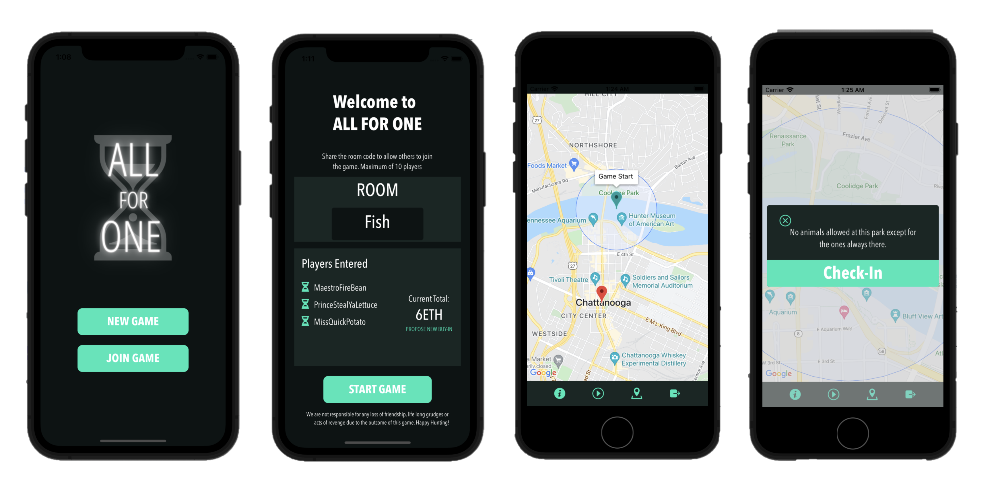

<p align="center">
  
</p>

All For One is a mobile real life scavenger hunt game.

## Screenshots

<p align="center">
  
</p>


## Getting started

Except for the regular suspects - git, Node, npm, etc - you need these things to run the All For One app. Follow the instructions supplied on their links before you continue with *Installation*.

* Postgres database, download and install from [here](https://www.postgresql.org/download/).
* Expo Client. Download it on your mobile device from your app store of choice. For more info, see [here](https://docs.expo.dev).
* Set Up Python, Django and virtual environment for Python. Download and install [here](https://medium.com/@diwassharma/starting-a-python-django-project-on-mac-os-x-c089165cf010).

## Installation

1. Clone the repo

```
git clone https://github.com/Fatima031598/AllForOne
cd AllForOne
```

2. Install dependencies
```
cd client
npm install
```

3. Start the socket server
```
cd serverSocket
npm install
npx nodemon
```

4. Start the python server
```
cd gameplay_server
source env/bin/activate
python3 manage.py runserver
```

4. Start development server
```
cd client
expo start
```

5. Scan the barcode with the Expo app on your phone or follow the terminal instructions to load up the simulator on your machine.

 ## Tech Stack
 [React Native](https://reactnative.dev/), [Expo](https://expo.io), [React Native Maps](https://github.com/react-community/react-native-maps), [JavaScript](https://www.javascript.com/), [Python](https://www.python.org/), [Express](https://expressjs.com/), [socket.IO](https://socket.io/),  [PostgreSQL](https://www.postgresql.org/), [Django](https://www.djangoproject.com/start/overview/)


 ## Contributing

Improvements are welcome :)

Fork the repo and do your thing. Push to your fork and submit a pull request.


## Developers

* Fatima Tapiya - [Github](https://github.com/Fatima031598) - [LinkedIn](https://www.linkedin.com/in/fatima-tapiya/)
* Savannah Manning - [GitHub](https://github.com/savhappy) - [LinkedIn](https://www.linkedin.com/search/results/all/?keywords=savannah%20manning&origin=RICH_QUERY_SUGGESTION&position=0&searchId=0ff5c9a9-ea99-4b7f-80a7-64bdd46ae412&sid=zM()
* Dane Johnson - [GitHub](https://github.com/Rudy451) - [LinkedIn](https://www.linkedin.com/in/dane-johnson-aa3606111/)

